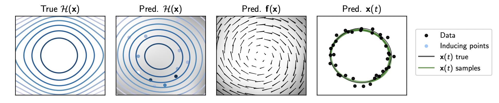

# Hamiltonian GPs




Implements Hamiltonian Gaussian processes, from the paper "Learning Energy Conserving Dynamics Efficiently with Hamiltonian Gaussian Processes" by Magnus Ross and Markus Heinonen, to appear in TMLR (March 2023). You can find a preprint [here](https://arxiv.org/abs/2303.01925).

This implementation was based on code developed by [Pashupati Hedge](https://github.com/hegdepashupati), for the [GP-ODE model](https://github.com/hegdepashupati/gaussian-process-odes).

### Installation

First create a new conda environment and activate it (this is optional).
```
conda create --name hgp_env python=3.9
conda activate hgp_env
```
Then clone this repo.
```
git clone https://github.com/magnusross/hgp.git 
cd hgp
```
Then install the requirements and package. 
```
pip install -r requirements.txt
pip install -e .
```


### Notebook

After installation, it is recommended to have a look at the demo notebook (`hgp_demo.ipynb`), which shows the model in action.

The notebook shows how the model can be applied to some data and the predictions visualized. 

### Running experiments 

The experiments in the paper can be found in the `experiments` directory, There are 3 experiment types implemented:

1. `intial_pendulum`: Runs a simple comparison of the HGP vs GPODE prior for the simple pendulum system, and generates figure 4 from the paper. 
2. `forward_trajectory`: Fits a model on a system for the problem of trajectory forecasting, described as task 1 in the paper.
3. `multiple_trajectory`: Fits a model on a system for the problem of initial condition extrapolation, described as task 2 in the paper.

The results of each experiment are saved in `outputs/EXPERIMENT_NAME/YYYY-MM-DD/HH-MM-SS`. We use the [Hydra](https://hydra.cc) framework to organize experiments.

Run an experiment using:
```
python experiments/EXPERIMENT_NAME/experiment.py       
```
The experiments are set up to run using the configurations discussed in the paper. The configuration files, which exhaustively specify the parameters for each model, can be found in `experiments/EXPERIMENT_NAME/conf`. For both the `forward_trajectory`, and `multiple_trajectory` experiments, it is possible run using different models and on different systems. To do this run
```
python experiments/EXPERIMENT_NAME/experiment.py model=MODEL_NAME system=SYSTEM_NAME   
```
The possible model names and their corresponding descriptions are below:

| Name                | Description                                |
|---------------------|--------------------------------------------|
| `hgp_cons_shooting` | HGP with energy conserving shooting.       |
| `hgp_shooting`      | HGP with normal shooting.                  |
| `hgp_standard`      | HGP with no shooting.                      |
| `hgp_subseq`        | HGP with batched training on subsequences. |
| `gpode_shooting`    | GPODE with normal shooting.                |
| `hnn`               | Hamiltonian neural network.                |
| `node`              | Neural ODE.                                |

The possible system names are `simplependulum`, `springpendulum` and `henonheiles`, and are as described in the paper. If no system name or model name is specified, then the defaults are `hgp_cons_shooting` and `henonheiles`.

Running the experiments will generate a single result with a single random seed. It is possible to sweep over different seeds, and over models and systems. For example
```
python experiments/forward_trajectory/experiment.py -m model=hgp_cons_shooting,hnn system.seed="range(1,11)" system=springpendulum,henonheiles
```
would run 10 repeats for the forward trajectory experiment using the `hgp_cons_shooting` and `hnn` models on both the `springpendulum` and `henonheiles` systems, so a total of 10 x 2 x 2 = 40 experiments. For more information on these sweeps, see the [Hydra docs](https://hydra.cc/docs/1.0/tutorials/basic/running_your_app/multi-run/#internaldocs-banner). 

It is also possible to override the standard configs, for example:
```
python experiments/forward_trajectory/experiment.py model=hgp_cons_shooting system=henonheiles num_iter=1000 model.num_inducing=32
```
For explanation of the possible parameters, consult `hgp_demo.ipynb` or the doc strings in the code.